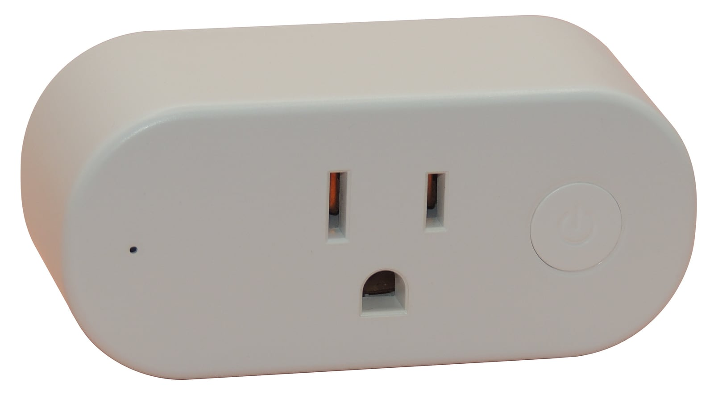

## Product Description

The KAUF PLF10 is a US 120 V smart plug that ships running ESPHome, so there is nothing to flash, solder or
disassemble — it can be adopted into ESPHome Device Builder over Wi-Fi. Inside is an ESP8266 with a relay rated
for a 15 amp resistive load, HLW8012 power monitoring, a button, and separate red and blue LEDs.

Kauf notes the plug is not appropriate for large capacitive or inductive loads, which includes things like water
and air pumps.

On the PLF10 the outlet is centred, with the LED to the left of the plug and the button to the right. The newer
[PLF12](/devices/kauf-plf12/) uses a different board and a different power monitoring chip; firmware is not
interchangeable between the two.

## Product Image



## GPIO Pinout

| Pin    | Function                     |
| ------ | ---------------------------- |
| GPIO0  | Red LED (active low)         |
| GPIO2  | Blue LED (active low)        |
| GPIO4  | Relay                        |
| GPIO5  | HLW8012 CF                   |
| GPIO12 | HLW8012 SEL (inverted)       |
| GPIO13 | Button (pull-up, active low) |
| GPIO14 | HLW8012 CF1                  |

## Basic Configuration

```yaml file=config.yaml
```

## Taking Control

The plug arrives running Kauf's own ESPHome build. To move it to your own ESPHome instance, either adopt it from
the ESPHome Device Builder dashboard, or point your configuration at Kauf's yaml as a package so their updates
keep flowing:

```yaml inline
packages:
  kauf.plf10: github://KaufHA/PLF10/kauf-plug.yaml
```

Holding the button for 30 seconds re-enables the access point and captive portal, which is how you recover a plug
that can no longer reach your network.

## Upstream Configuration

The full firmware Kauf ships, including per-unit power monitoring calibration and the LED and button behaviour:

```yaml url=https://github.com/KaufHA/PLF10/blob/main/kauf-plug.yaml
```
